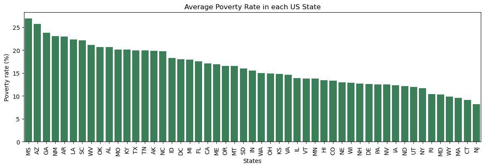
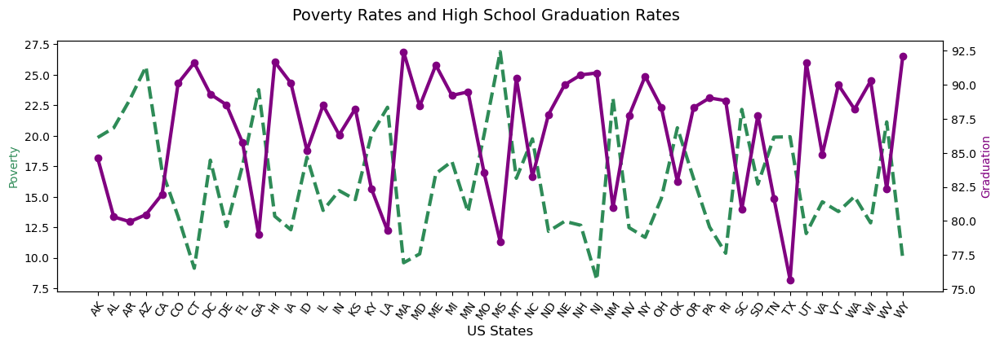
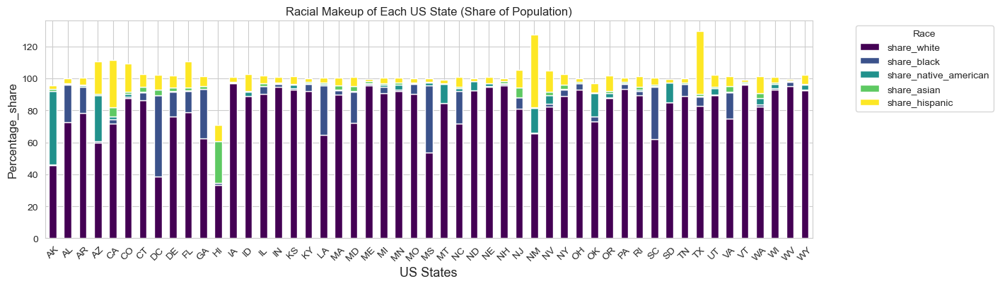
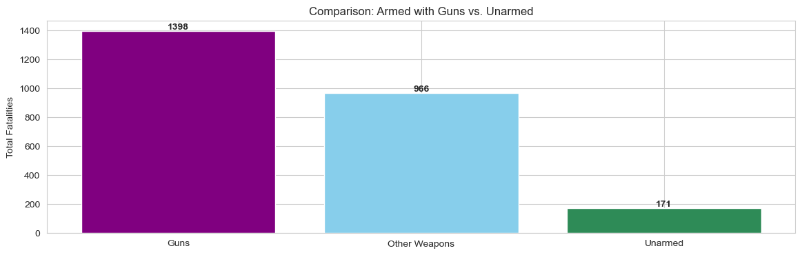
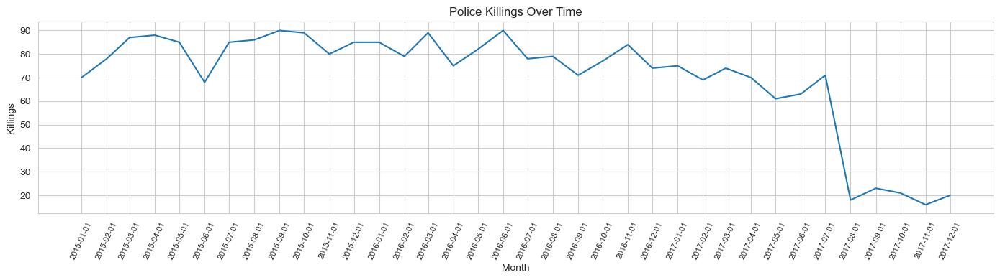

# 🚔 Fatal Force Analysis in the United States

## Overview

This project analyzes police use-of-force incidents in the United States using publicly available data. The analysis explores trends in fatal police shootings across states, cities, races, age groups, and mental health indicators to uncover patterns and disparities.

The project was completed as part of Day 99 – Capstone Project in Angela Yu’s 100 Days of Code: The Complete Python Pro Bootcamp.

## Project Objectives

The primary objectives of this project were to:

* Clean and preprocess real-world datasets
* Explore trends in police-related fatalities
* Identify demographic patterns among victims
* Examine geographic differences across states and cities
* Analyze racial distribution of fatalities
* Visualize trends using informative charts and maps
* Practice exploratory data analysis (EDA) using Python

## Dataset

The project uses publicly available data on police killings in the United States.

The dataset includes information such as:

* Date of incident
* State
* City
* Age
* Gender
* Race
* Armed status
* Mental illness indicator
* Manner of death
* Threat level
* Body camera usage
* Fleeing status

## Tools & Technologies

* Python
* Pandas
* NumPy
* Matplotlib
* Plotly Express
* Plotly Graph Objects

## Project Workflow

1. Data Cleaning

* Imported datasets
* Checked missing values
* Removed duplicate records
* Converted dates to datetime format
* Standardized categorical variables
* Handled incomplete observations

2. Exploratory Data Analysis

Performed analysis on:

* Fatal incidents over time
* Fatalities by state
* Fatalities by city
* Victim age distribution
* Gender distribution
* Race distribution
* Armed vs unarmed victims
* Mental illness indicators

3. Geographic Analysis

Analyzed:

* States with the highest number of fatalities
* Cities with the most reported incidents
* Regional patterns across the United States

4. Demographic Analysis

Explored relationships between:

* Race and fatalities
* Age groups
* Gender
* Mental illness
* Threat level
* Armed status

Key Questions Answered

* Which states report the highest number of fatal police shootings?
* Which cities have the most incidents?
* How have fatal incidents changed over time?
* What is the age distribution of victims?
* How are fatalities distributed across racial groups?
* How frequently were victims reported as armed?
* What percentage of victims showed signs of mental illness?
* How often were body cameras present during incidents?

## Visualizations 

## Key Insights

* Fatal police shootings are concentrated in a relatively small number of states.
* Several metropolitan areas account for a large share of reported incidents.
* Most victims were reported as armed, although unarmed fatalities remain present in the dataset.
* Fatalities span all adult age groups, with younger adults representing a significant portion of incidents.
* The analysis highlights demographic differences across race, age, and gender that warrant further investigation.
* Exploratory data analysis helps identify patterns but does not establish causation.

## Skills Demonstrated

* Data Cleaning
* Exploratory Data Analysis (EDA)
* Data Wrangling
* Data Visualization
* Time Series Analysis
* Geographic Analysis
* Statistical Summarization
* Python Programming
* Storytelling with Data

## Future Improvements

* Build an interactive Tableau dashboard
* Perform statistical significance testing
* Develop predictive models to identify factors associated with fatal encounters
* Integrate U.S. Census data for population-adjusted analyses

## What I Learned

Through this project, I strengthened my skills in:

* Cleaning messy real-world datasets
* Performing exploratory data analysis
* Creating meaningful visualizations
* Identifying trends and patterns in complex datasets
* Communicating analytical findings through data storytelling
